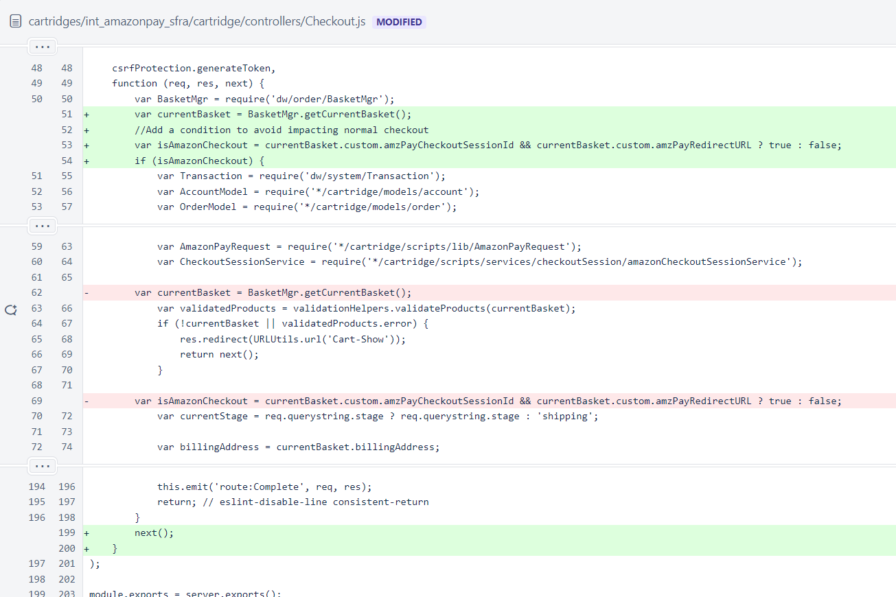
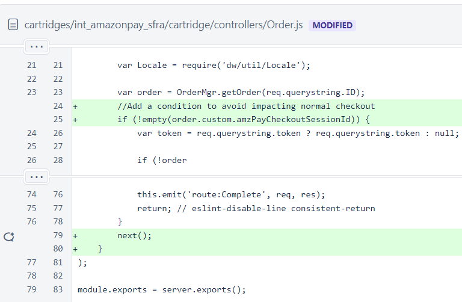

# AmazonPay SFRA Version

To get Amazon Pay cartridge, go to [Amazon seller central](https://sellercentral.amazon.com/external-payments/sandbox/home) and click Integration Central. From the solution provider dropdown, select "Salesforce Commerce Cloud" and SFRA version, then get instructions. The current version is 19.1.0<br>
Follow the [documentation](documentation/Amazon%20Payments%20SFRA%20LINK%20Cartridge%20Documentation.docx) to install the cartridges. However, there are some issues during the implementation.

### Setup
- Put *`int_amazonpay_sfra`* between *`app_project_core`* and *`app_accelerator_core`* in cartridge paths for AFX version of Born

- APN Shared Token. ~~How/Where to obtain the token is not addressed in the documentation or on the website.~~ This can be set to anything.

- Public Key and Private Key. The way to generate keys via Integration Central is incorrect, because the keys generated by Integration Central are not supported by the cartridge code. See the method `getKey()` in ***int_amazonpay_sfra/cartridge/scripts/lib/pssSig.js***. To get keys in correct format, you can use an online RSA generator to generate public and private keys, and create a public key in the Integration Central and paste the private key to site preferences.

### Custom Code
- ~~Probably because the code change is for SFRA only, not for Born's AFX. When the frontend JS is added to the build, there will be webpack issues. JS scripts on buttons won't work.~~
In package.json, add *`int_amazonpay_sfra`* between *`app_accelerator_core::core`* and *`app_storefront_base::base`* for AFX to avoid frontend JS overwrite. In general, add cartridge path right before *`app_storefront_base::base`*

- `cartridges/int_amazonpay_sfra/cartridge/controllers/Cart.js`
Clear `amzPayCheckoutSessionId` and `amzPayRedirectURL` in basket to ensure when customers change their mind to use normal checkout instead of AmazonPay, they are able to check out.
```js
server.append('Show', function (req, res, next) {
    var Resource = require('dw/web/Resource');
    //Custom change to avoid impacting normal checkout
    var Transaction = require('dw/system/Transaction');
    var BasketMgr = require('dw/order/BasketMgr');
    var currentBasket = BasketMgr.getCurrentBasket();
    if (currentBasket) {
        Transaction.wrap(function () {
            currentBasket.custom.amzPayCheckoutSessionId = null;
            currentBasket.custom.amzPayRedirectURL = null;
        });
    }
    //Custom change end

    var viewData = res.getViewData();
    var query = req.querystring;
    if (query.amzError) {
        viewData.amzError = true;
        viewData.errorMessage = Resource.msg('error.message.' + query.errorMessage, 'amazon', null);
    }

    res.setViewData(viewData);
    return next();
});
```
- `cartridges/int_amazonpay_sfra/cartridge/controllers/Checkout.js`
Add a condition to avoid impacting normal checkout(also remember to add `currentBasket` null check)


- `cartridges/int_amazonpay_sfra/cartridge/controllers/Order.js`
Add a condition to avoid impacting normal checkout


- For tax calculation, AmazonPay saves the shipping address to shipment in cart. If the project is integrated with Vertex, Vertex uses the address from forms to calculate tax. In order to work with AmazonPay, custom change is as below in `cartridges/int_vertex/cartridge/scripts/init/initVertexApi.js`
```js
  var forms = session.forms;
    if (!empty(forms)) {
        if (forms.singleshipping) {
            // Check if singleshipping step passed then we have shipping data
            if (forms.singleshipping && forms.singleshipping.fulfilled.value) {
                shippingForm = forms.singleshipping.shippingAddress.addressFields;
            }
        } else if (forms.shippingAddress) {
            shippingForm = forms.shippingAddress.addressFields;
        } else if (forms.shipping) {
            shippingForm = forms.shipping.shippingAddress.addressFields;
        }
    }
// Start custom change
    if (shippingForm && !empty(shippingForm.address1.value)) {
        LocationTypeCustomer = new service.LocationType();
        LocationTypeCustomer.setStreetAddress1(shippingForm.address1.value);
        LocationTypeCustomer.setStreetAddress2(shippingForm.address2.value);
        LocationTypeCustomer.setCity(shippingForm.city.value);
        if (shippingForm.country.selectedOption) {
            LocationTypeCustomer.setCountry(shippingForm.country.selectedOption.value);
        }
        if (shippingForm.states.state) {
            LocationTypeCustomer.setMainDivision(shippingForm.states.state.htmlValue);
        } else if (shippingForm.states.stateCode) {
            LocationTypeCustomer.setMainDivision(shippingForm.states.stateCode.htmlValue);
        }
        if (shippingForm.postal) {
            LocationTypeCustomer.setPostalCode(shippingForm.postal.value);
        } else if (shippingForm.postalCode) {
            LocationTypeCustomer.setPostalCode(shippingForm.postalCode.htmlValue);
        }
        if (cart.shipments.length === 1) {
            CustomerCodeType = new service.CustomerCodeType();

            if (cart.customer.authenticated && cart.customer.registered) {
                CustomerCodeType.setValue(cart.customerNo);
            } else if (cart.billingAddress && !empty(session.forms)) {
                if (session.forms.billing.billingAddress) {
                    CustomerCodeType.setValue(session.forms.billing.billingAddress.email.emailAddress.value);
                } else if (session.forms.billing.contactInfoFields) {
                    CustomerCodeType.setValue(session.forms.billing.contactInfoFields.email.value);
                }
            }
            CustomerType.setCustomerCode(CustomerCodeType);

            CustomerType.setDestination(LocationTypeCustomer);
            RequestType.setCustomer(CustomerType);
        }
    }
    else {     // Vertex change for Bolt/AmazonPay
        var shippingAddr = cart.shipments ? cart.shipments[0].shippingAddress : null;
        if (shippingAddr) {
            LocationTypeCustomer = new service.LocationType();
            LocationTypeCustomer.setStreetAddress1(shippingAddr.address1);
            LocationTypeCustomer.setStreetAddress2(shippingAddr.address2);
            LocationTypeCustomer.setCity(shippingAddr.city);
            if (shippingAddr.countryCode.value) {
                LocationTypeCustomer.setCountry(shippingAddr.countryCode.value);
            }
            if (shippingAddr.stateCode) {
                LocationTypeCustomer.setMainDivision(shippingAddr.stateCode);
            }
            if (shippingAddr.postalCode) {
                LocationTypeCustomer.setPostalCode(shippingAddr.postalCode);
            }
            if (cart.shipments.length === 1) {
                CustomerCodeType = new service.CustomerCodeType();

                if (cart.customer.authenticated && cart.customer.registered) {
                    CustomerCodeType.setValue(cart.customerNo);
                } else if (cart.billingAddress && !empty(session.forms)) {
                    if (session.forms.billing.billingAddress) {
                        CustomerCodeType.setValue(session.forms.billing.billingAddress.email.emailAddress.value);
                    } else if (session.forms.billing.contactInfoFields) {
                        CustomerCodeType.setValue(session.forms.billing.contactInfoFields.email.value);
                    }
                }
                CustomerType.setCustomerCode(CustomerCodeType);

                CustomerType.setDestination(LocationTypeCustomer);
                RequestType.setCustomer(CustomerType);
            }
        }
    }
//End custom change
```
### Limitations
- The Amazon Pay cartridge is compatible with Salesforce Commerce Cloud Storefront Reference Architecture 4.3.0.

- The Amazon Pay cartridge is limited to merchants in US, UK, JP and Germany markets. The cartridge is configured via Business Manager for the corresponding country.

- Shipping to multiple addresses and BOPIS are out of scope for this implementation of the cartridge.

- This implementation assumes no integration with a third-party order management system.

- Amazon Checkout seems not to support checkout from minicart page, and only entry is from cart page.